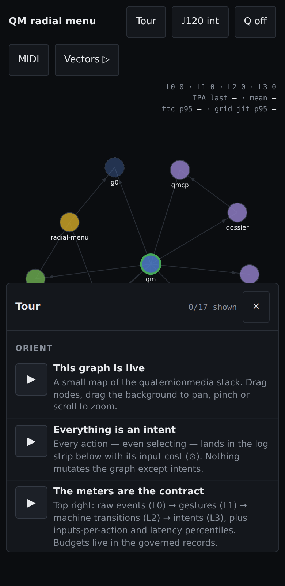
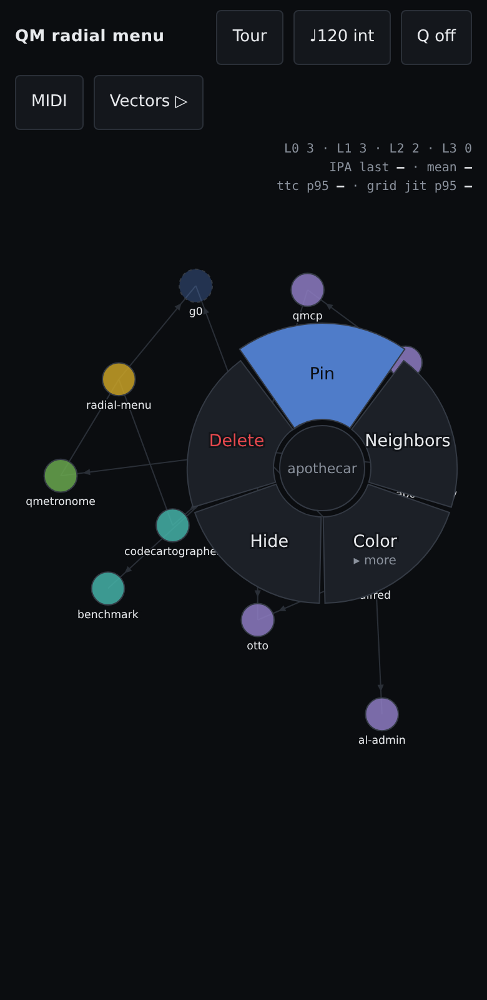
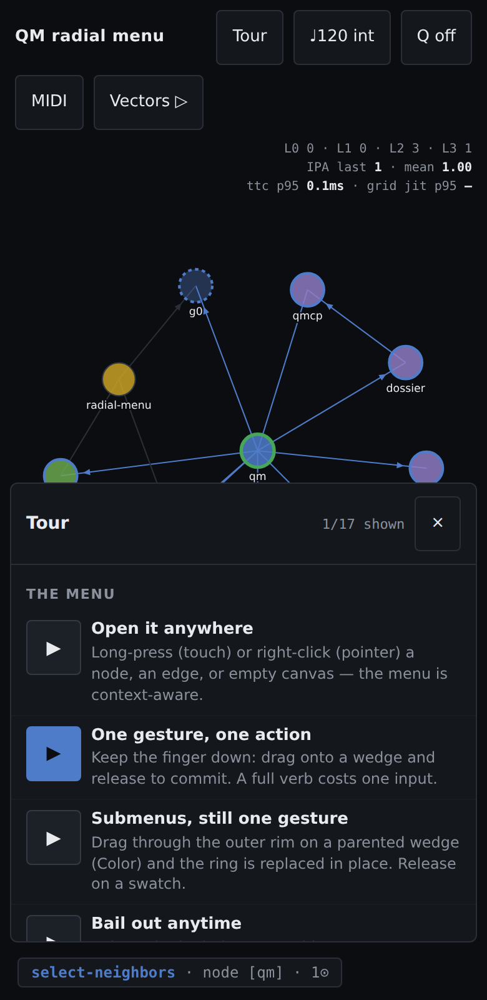
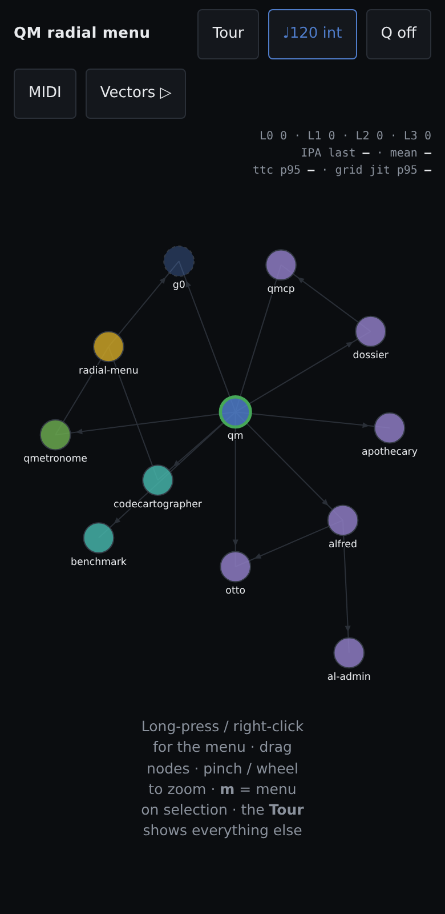
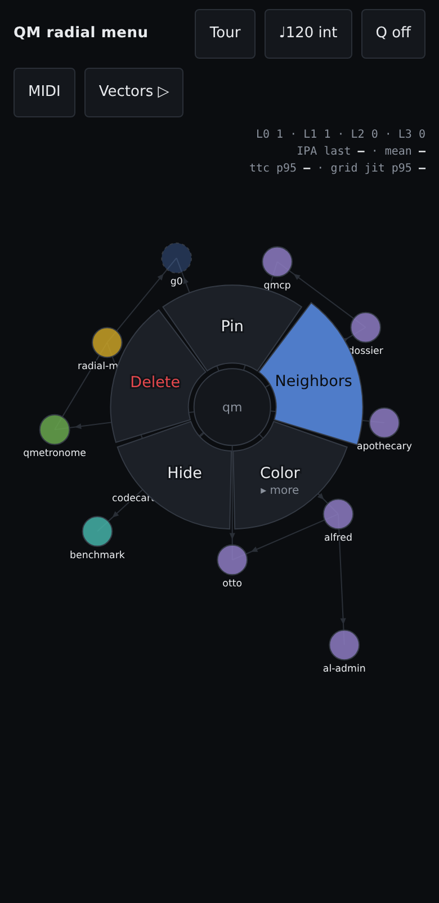
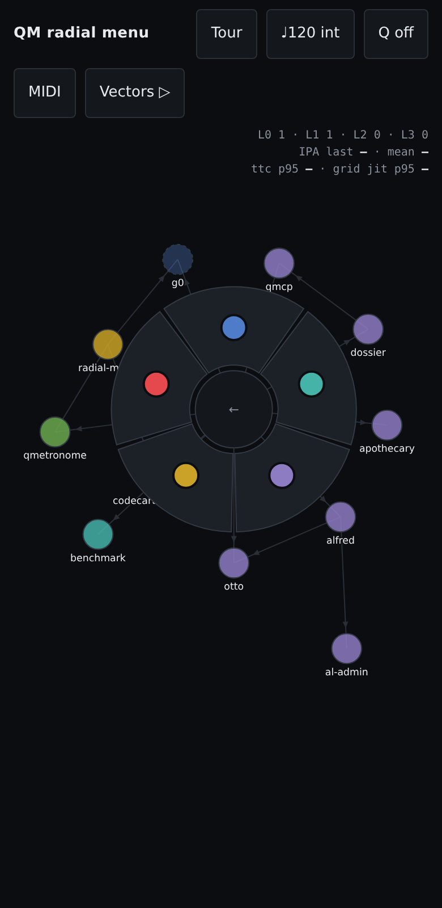
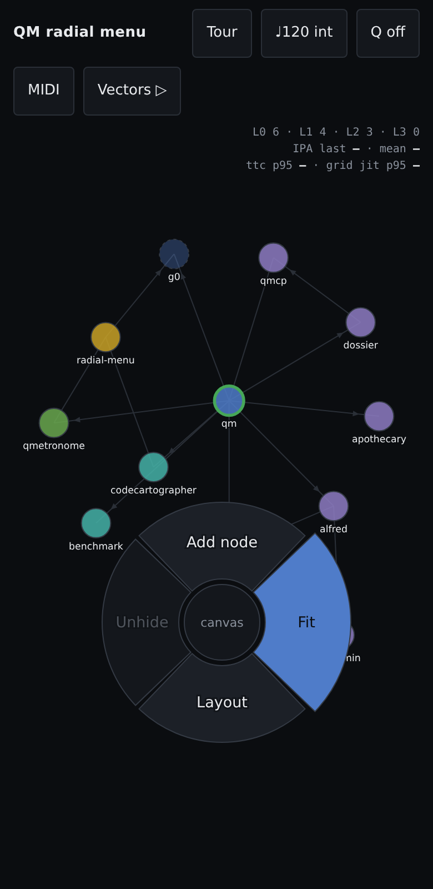
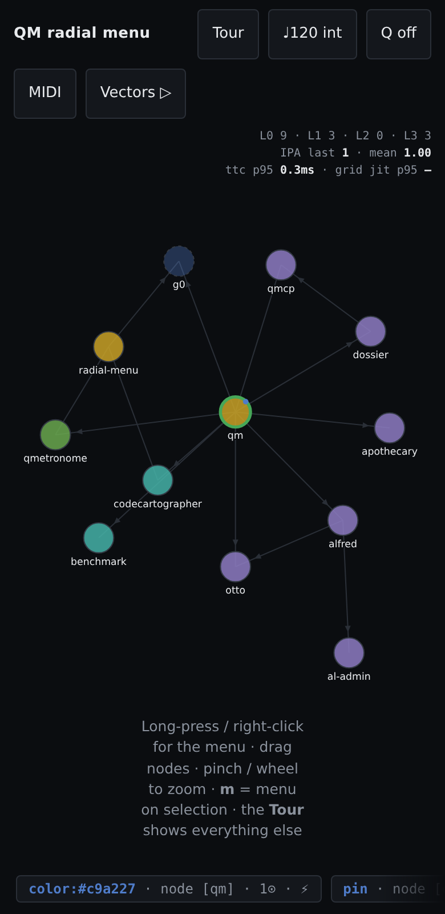
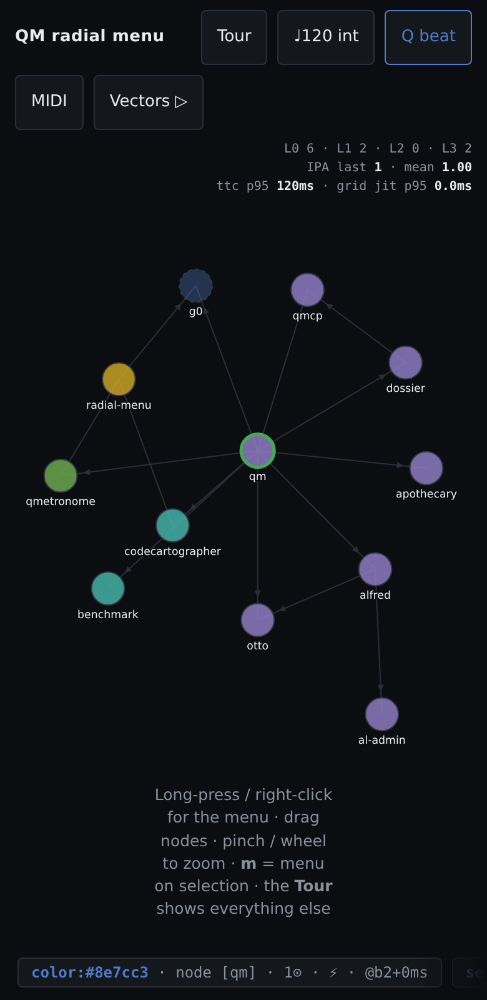
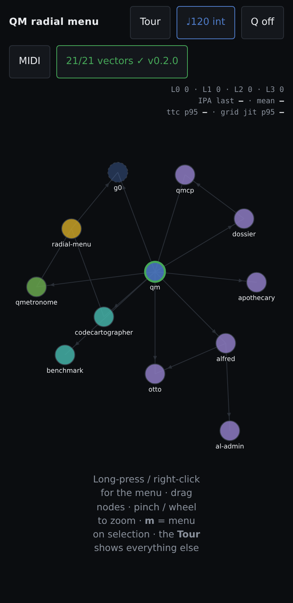

# radial-menu

Cross-platform radial menu for graph manipulation — served as a single-page
splash (`index.html`, zero dependencies) that **teaches itself**: the built-in
Tour is a linked list of actions that run live on the graph, ghost-finger and
all. Governed by the records in [docs/records](docs/records) under the qm
constitution; interpretive-governance notes for **g0** in
[docs/perspectives](docs/perspectives).

**Deploy:** every push runs `tests/run.mjs` in CI
([.github/workflows/pages.yml](.github/workflows/pages.yml)); only a green
harness publishes to GitHub Pages. The splash, its docs, and its media are one
build output — a red test means a stale page never ships.

**Vectors 0.2.0: ✅ · topics 10/10 verified · conformance cases: 21**

The contract is the seam: a platform-neutral interaction contract plus
executable conformance vectors. This web prototype is the reference
implementation; Android/Compose is specified in
[docs/records/DRAFT-radial-menu-platform-plans.md](docs/records/DRAFT-radial-menu-platform-plans.md).


## Topics

Every row below is generated from one entry in `tests/topics.mjs` — the same
entry is the e2e test, the guide page, and the media producer.

| | Topic | Status |
|---|---|---|
|  | [**Onboarding tour (the page teaches itself)**](docs/guide/tour.md) — The splash opens with a single Tour panel — the only menu on the page. | ✓ |
|  | [**Accessibility as foundation**](docs/guide/a11y-foundation.md) — Keyboard walks the graph: Tab reaches a node, arrows move focus geometrically (green ring), Enter opens the menu there, arrows + Enter commit — pointer never required. | ✓ |
|  | [**Reduced motion honored**](docs/guide/reduced-motion.md) — With prefers-reduced-motion set, the motion module jumps every tween to its end state and CSS animations are disabled globally — the tour still works, it just stops moving.. | ✓ |
|  | [**Graph canvas**](docs/guide/overview.md) — The prototype ships a small map of the quaternionmedia stack. | ✓ |
|  | [**Release-select (one gesture, one action)**](docs/guide/release-select.md) — Long-press a node; the menu opens under the finger. | ✓ |
|  | [**Submenu by drag-through**](docs/guide/submenu-drag-through.md) — Wedges with children open in place when the finger crosses the outer rim — still one gesture. | ✓ |
|  | [**Keyboard navigation**](docs/guide/keyboard-path.md) — Right-click (or m) opens the menu idle; arrows rotate the highlight, Enter commits, Escape backs out. | ✓ |
|  | [**Chorded input (CharaChorder path)**](docs/guide/chord-input.md) — Chords arrive as machine-fast words over plain HID — no driver. | ✓ |
|  | [**Quantized commit (MIDI-clock ready)**](docs/guide/quantized-commit.md) — With Q on, intents are scheduled to the next beat (or bar) and stamped with their grid delta — @b12+0.3ms. | ✓ |
|  | [**Conformance vectors, in-page**](docs/guide/conformance.md) — The same pure core (geometry, state machine, quantizer, tempo estimator, chord classifier) that drives the UI replays conformance/vectors.json on demand. | ✓ |

## Measured (this run)

| Metric | Value | Budget |
|---|---|---|
| IPA, chord verbs | 1 | 1 |
| TTC p95 (chord) | 0.3 ms | ≤ 16 ms |
| Grid jitter p95 | 0.00 ms | ≤ 1 ms |

## Chord vocabulary (extracted live from the prototype)

Prefix-free; a known word commits on its last keystroke. CharaChorder-class
devices hit these as single chords over plain HID.

| word | verb |
|---|---|
| `pin` | `pin` |
| `hd` | `hide` |
| `del` | `delete` |
| `nbr` | `select-neighbors` |
| `fit` | `fit` |
| `lay` | `relayout` |
| `add` | `add-node` |
| `un` | `show-hidden` |
| `sp` | `spread` |
| `cl` | `cluster` |
| `ds` | `clear-selection` |
| `red` | `color:#e5484d` |
| `blu` | `color:#4f7cc9` |
| `tea` | `color:#45b3a8` |
| `vio` | `color:#8e7cc3` |
| `gld` | `color:#c9a227` |

## Layout

```
index.html                the splash: demo + tour + meters, single file, no deps
conformance/vectors.json  executable half of the contract (v0.2.0)
docs/records/             governed drafts (contract · metrics · platform plans · pipeline)
docs/perspectives/        g0 interpretive-governance notes
docs/guide/  docs/media/  GENERATED — never edit; every file is test output
tests/topics.mjs          the one registry: tests = docs = README = pics = vids
tests/run.mjs             the harness; `node tests/run.mjs` regenerates everything
.github/workflows/        CI: harness gates the Pages deploy
```

## Accessibility (foundational, not bolted on)

Keyboard is a complete path: Tab reaches the graph, arrows walk node focus
geometrically, Enter opens the menu, arrows + Enter commit. The menu traps Tab
while open; wedges are labelled menuitems; highlight changes are announced to
a live region; `prefers-reduced-motion` collapses every animation (including
tour demos) to end states; touch targets respect a 44px floor; a skip link
jumps straight to the tour. The `a11y-foundation` and `reduced-motion`
topics above verify this on every run.

*README generated by `tests/run.mjs`. Numbers above are measurements, not
copy — if they are stale, the build is red.*
