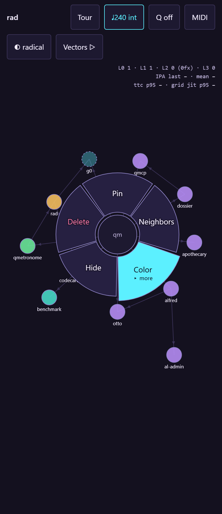
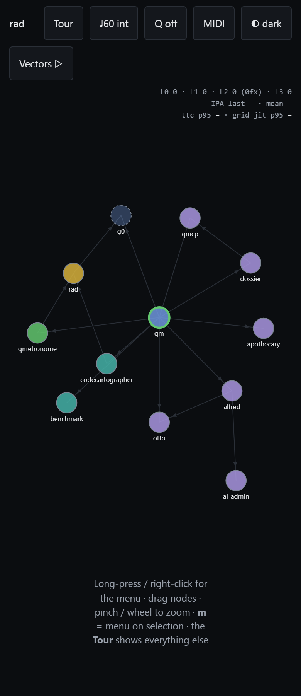

# rad

**QM's default radial menu.** A platform-neutral interaction contract, executable
conformance vectors, and a single-file web reference implementation
(`index.html`, zero runtime dependencies) that **teaches itself**: the built-in
Tour is a linked list of actions that run live on the graph, ghost-finger and
all, paced by the same clock the menu commits on.

Governed by the records in [adr/](adr) under the
[qm constitution](https://github.com/quaternionmedia/qm); adoption status, the
conflict table, and the steps still owed are in
[adr/DRAFT-rad-adoption-and-scope.md](adr/DRAFT-rad-adoption-and-scope.md).
An honest review of this repository is in [REVIEW.md](REVIEW.md).

**Vectors v0.3.0 · 12/12 topics verified · 34 conformance cases · 4 themes**

The contract is the seam: a platform-neutral interaction contract plus
executable conformance vectors. This web prototype is the reference
implementation; Android/Compose is specified in
[adr/DRAFT-rad-platform-plans.md](adr/DRAFT-rad-platform-plans.md).


## Topics

Every row below is generated from one entry in `tests/topics.mjs` — the same
entry is the e2e test, the guide page, and the media producer.

| | Topic | Status |
|---|---|---|
|  | [**Onboarding tour (the page teaches itself)**](docs/guide/tour.md) — The splash opens with a single Tour panel — the only menu on the page. | ✓ |
|  | [**Accessibility as foundation**](docs/guide/a11y-foundation.md) — Keyboard walks the graph: Tab reaches a node, arrows move focus geometrically (green ring), Enter opens the menu there, arrows + Enter commit — pointer never required. | ✓ |
|  | [**Reduced motion honored**](docs/guide/reduced-motion.md) — With prefers-reduced-motion set, the motion module jumps every tween to its end state and CSS animations are disabled globally — the tour still works, it just stops moving. | ✓ |
|  | [**Graph canvas**](docs/guide/overview.md) — The prototype ships a small map of the quaternionmedia stack. | ✓ |
|  | [**Release-select (one gesture, one action)**](docs/guide/release-select.md) — Long-press a node; the menu opens under the finger. | ✓ |
|  | [**Submenu by drag-through**](docs/guide/submenu-drag-through.md) — Wedges with children open in place when the finger crosses the outer rim — still one gesture. | ✓ |
|  | [**Keyboard navigation**](docs/guide/keyboard-path.md) — Right-click (or m) opens the menu idle; arrows rotate the highlight, Enter commits, Escape backs out. | ✓ |
|  | [**Chorded input (CharaChorder path)**](docs/guide/chord-input.md) — Chords arrive as machine-fast words over plain HID — no driver. | ✓ |
|  | [**Quantized commit (MIDI-clock ready)**](docs/guide/quantized-commit.md) — With Q on, intents are scheduled to the next grid point and stamped with their delta — @b12+0.3ms. | ✓ |
|  | [**Four themes over one token layer**](docs/guide/themes.md) — Colour is a token, never a literal. | ✓ |
|  | [**Three speed axes, MIDI-drivable**](docs/guide/speed-axes.md) — Tempo (bpm) sets the beat grid, Grid subdivides it, and Actions (aps) is the rate scripted playback issues intents. | ✓ |
|  | [**Conformance vectors, in-page**](docs/guide/conformance.md) — The same pure core (geometry, state machine, quantizer, tempo estimator, chord classifier, speed axes) that drives the UI replays conformance/vectors.json on demand. | ✓ |

## Measured (this run)

Every number here was read out of the running artifact during the run that
generated this file. A figure that cannot be measured fails the build rather
than printing a placeholder, and a percentile below 20 samples is refused
rather than reported.

| Metric | Value | Samples | Budget |
|---|---|---|---|
| IPA, release-select gesture | 1 | 1 verb | 1 |
| IPA, chord verbs (worst case) | 1 | 32 verbs | 1 |
| TTC p95, chord | 2.50 ms | 33 | ≤ 16 ms |
| Grid jitter p95, quantized | 0.00 ms | 24 | ≤ 1 ms |

## Speed: three axes, MIDI-drivable

Tempo sets the beat grid, Grid subdivides it, and Actions is the rate scripted
playback issues intents — linked to tempo by default, freeable. The shipped
default is deliberately slow, because a demo paced for its author teaches
nothing: **60 bpm, 1 action per second**.

| Axis | Range | Default | MIDI CC |
|---|---|---|---|
| `bpm` | 30–300 | 60 | 20 |
| `div` | ½ · 1 · 2 · 3 · 4 per beat | 1 | 22 |
| `aps` | 0.25–8 | 1 (linked) | 21 |
| quantize | off · beat · bar | off | 23 |

System Real-Time transport drives playback: `0xFA` start, `0xFB` continue,
`0xFC` stop. The interaction constants (`longPressMs`, slop, the burst window)
deliberately do **not** scale with tempo — that would make every conformance
vector tempo-dependent.

## Themes

`radical` · `dark` · `light` · `contrast` — palette swaps over one token layer. Every text pair is
contrast-tested in every theme at the WCAG threshold for its rendered size, and
`color:` intents name palette tokens (`sky`, `calm`, `royal`, `gold`, `signal`), never
literals, so a recorded intent replays correctly under a theme that did not
exist when it was recorded.

## Geometry (extracted live)

| | |
|---|---|
| dead zone `r₀` | 36 |
| ring outer `r₁` | 108 |
| cancel bound `r_cancel` | 145.8 (1.35 × r₁) |
| items per ring | ≤ 8, enforced |
| long press | 350 ms, slop 10 |

Inward of `r₀` and outward of `r_cancel` are the same cancel affordance, and
both commit styles agree about every radius.

## Chord vocabulary (extracted live from the prototype)

Prefix-free — asserted by a conformance vector, because that property is what
the latency claim rests on. A known word commits on its last keystroke.
CharaChorder-class devices hit these as single chords over plain HID.

| word | verb |
|---|---|
| `pin` | `pin` |
| `hd` | `hide` |
| `del` | `delete` |
| `nbr` | `select-neighbors` |
| `fit` | `fit` |
| `lay` | `relayout` |
| `add` | `add-node` |
| `un` | `show-hidden` |
| `sp` | `spread` |
| `cl` | `cluster` |
| `ds` | `clear-selection` |
| `red` | `color:signal` |
| `blu` | `color:sky` |
| `tea` | `color:calm` |
| `vio` | `color:royal` |
| `gld` | `color:gold` |

## Layout

```
index.html                the splash: demo + tour + meters, single file, no deps
conformance/vectors.json  executable half of the contract (v0.3.0) — the SOURCE;
                          index.html's inline block is generated from it
adr/                      governed records under the qm constitution
perspectives/             non-binding notes
tests/topics.mjs          the one registry: tests = docs = README = pics = vids
tests/*.spec.mjs          contract · conformance · a11y · theme · speed · metrics
scripts/build-docs.mjs    regenerates this file and docs/ from a GREEN run
docs/guide/  docs/media/  GENERATED — never edit; every file is test output
.github/workflows/        CI: the suite gates the Pages deploy, on PRs too
```

## Accessibility

Keyboard is a complete path: Tab reaches the graph, arrows walk node focus
geometrically, Enter opens the menu, arrows + Enter commit. The skip link moves
focus rather than only the scroll position; the menu traps Tab while open;
wedges are labelled menuitems; **exactly one** live region announces, with the
intent log hidden from assistive tech rather than competing with it;
`prefers-reduced-motion` collapses every animation, including the tour's, to end
states at any tempo; touch targets respect a 44px floor. These are asserted by
driving the behaviour, not by checking that the elements exist.


*README generated by `scripts/build-docs.mjs`. Numbers above are measurements,
not copy — if they are stale, the build is red.*
