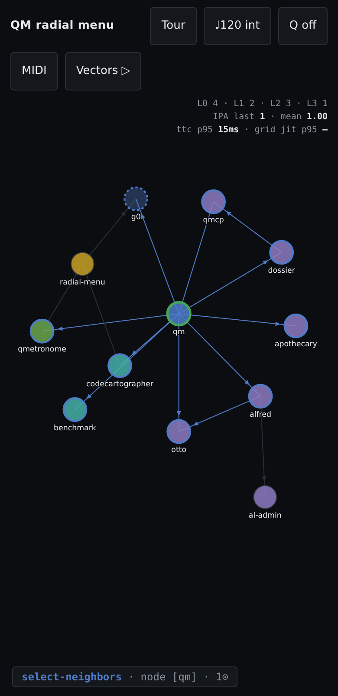

# Release-select (one gesture, one action)

Long-press a node; the menu opens under the finger. Drag onto a wedge and release to commit — a full verb in one continuous gesture (IPA 1). Releasing in the hub cancels.

**Verified:** ✓ all assertions pass

*Generated by `tests/run.mjs` — edits here are overwritten; edit `tests/topics.mjs`.*
