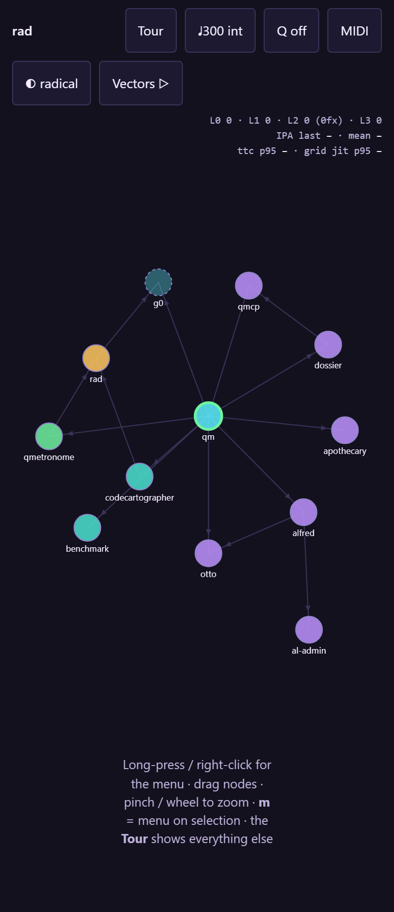

# Three speed axes, MIDI-drivable

Tempo (bpm) sets the beat grid, Grid subdivides it, and Actions (aps) is the rate scripted playback issues intents. Actions is linked to tempo by default and can be freed — a slow clock with dense actions is a real configuration and so is its inverse. All three are reachable over MIDI CC alongside the clock, and start/continue/stop drive tour playback. The shipped default is deliberately slow: 60 bpm, one action per second.

**Verified:** ✓ all assertions pass · vectors v0.3.0 · 34 cases

*Generated by `scripts/build-docs.mjs` from a green `npm test` run — edits here are
overwritten; edit `tests/topics.mjs`.*
