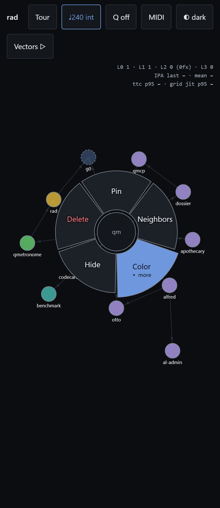
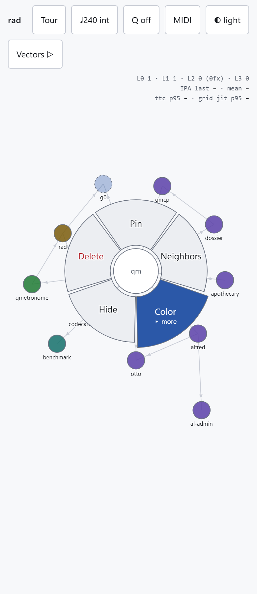
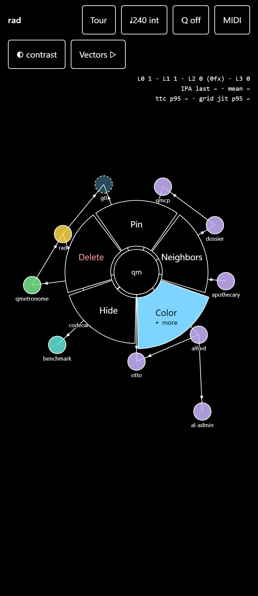

# Three themes over one token layer

Colour is a token, never a literal. Dark, light and a high-contrast theme are palette swaps over a single two-tier token layer; node hues, wedge fills and the swatch ring all resolve through it. Every text pair is contrast-tested in every theme at the WCAG threshold for its rendered size, which is how the destructive wedge label stopped failing AA.

**Verified:** ✓ all assertions pass · vectors v0.3.0 · 34 cases

*Generated by `scripts/build-docs.mjs` from a green `npm test` run — edits here are
overwritten; edit `tests/topics.mjs`.*
