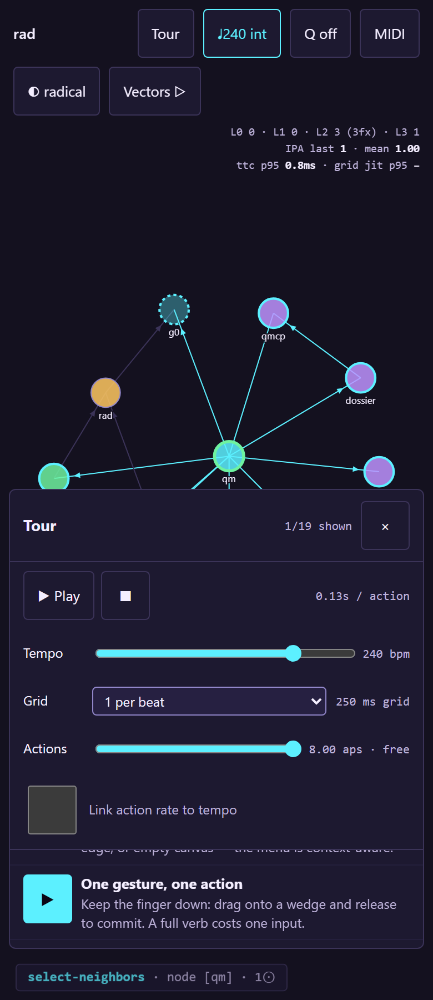

# Onboarding tour (the page teaches itself)

The splash opens with a single Tour panel — the only menu on the page. Every entry is a linked action: press ▶ and the ghost finger performs the feature on the live graph through the same code path real input uses. Steps are hash-addressable (#t-release-select) and marked once shown. Press Play and the whole tour runs itself at the current action rate.

**Verified:** ✓ all assertions pass · vectors v0.3.0 · 34 cases

*Generated by `scripts/build-docs.mjs` from a green `npm test` run — edits here are
overwritten; edit `tests/topics.mjs`.*
